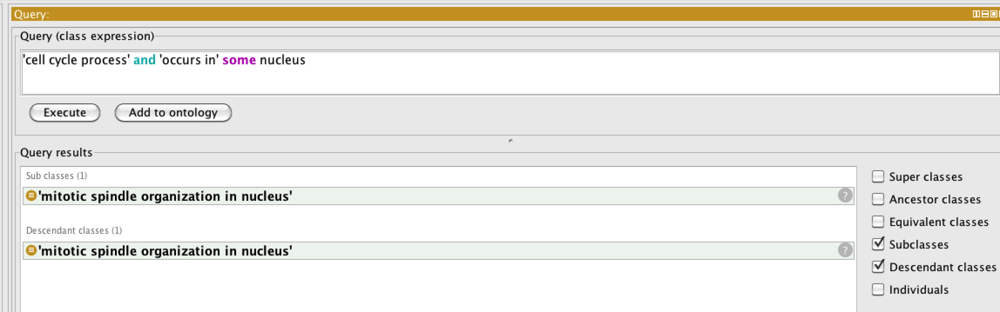
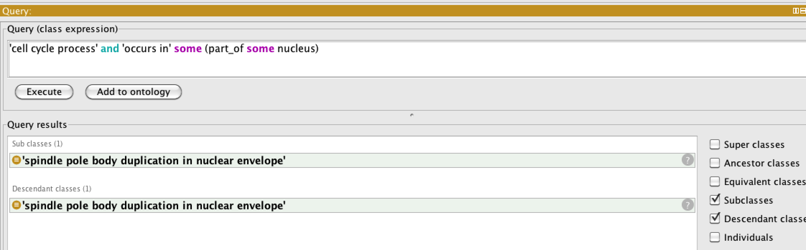
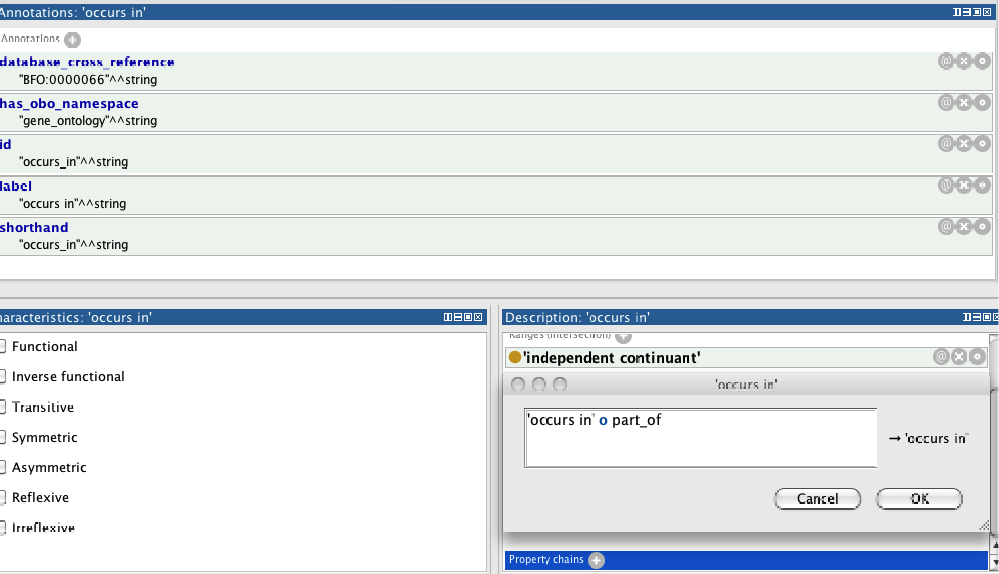
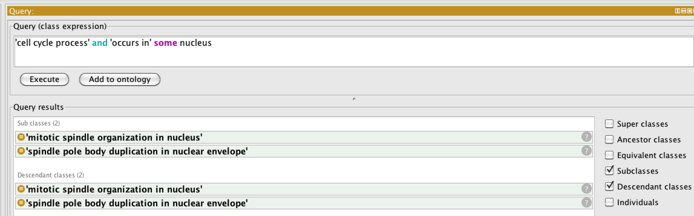
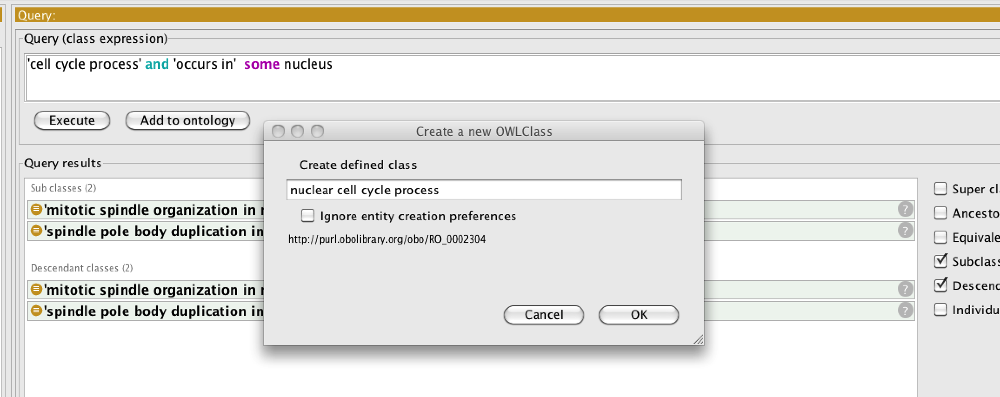
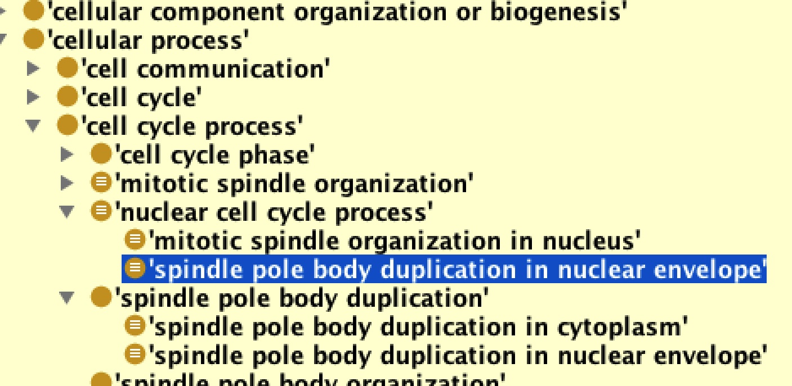

Automatic classification
========================

## EXERCISE: Basic classification

Go to the [basic-classification](https://github.com/geneontology/protege-tutorial/tree/master/basic-classification) folder and follow the instructions in the README.txt

## EXERCISE: Classification using Unions (Optional)

Optional additional exercise if time permits:

Go to [taxon-union](taxon-union) folder

This introduces classification using “or” and “not”

### Futher reading

[owl primer - advanced class relationships](https://www.w3.org/TR/owl2-primer/#Advanced_Class_Relationships])

### Do a DL query for cell cycle processes that occur in a nucleus – note there is only one result:

========================

Note that in this ontology, there is no axiom that allows the reasoner to know that something happening in a *part of* the nucleus is happening in the nucleus. Try a different query – this time for cell cycle processes in some part of the nucleus:

This behavior is undesirable – we want ‘spindle pole body duplication in nuclear envelope’ to be returned by the first query.

Add a property chain specifying a rule:

    If p occurs_in c
    And c part_of d
    Then p occurs_in d

as follows. Find `occurs in` in the Object Properties tab, and click “+” next to “Property Chains”. We write the chain as

`occurs_in o part_of -> occurs_in`

Synchronize the reasoner and then run the DL query again:

Note this gives the desired results.

One useful feature of the DL query tab is the ability to make a *defined class*[3] out of a query class expression. Let’s call this “nuclear cell cycle process”:

========================

You should now see this class automatically classified, with the two spindle pole processes underneath it.

NOTE: this may be broken in P4.1?

## EXERCISE: transport & property chains

Go to the [transport property chain exercise](https://github.com/geneontology/protege-tutorial/tree/master/transport_property_chain_excercise) folder and follow the instructions in the README
