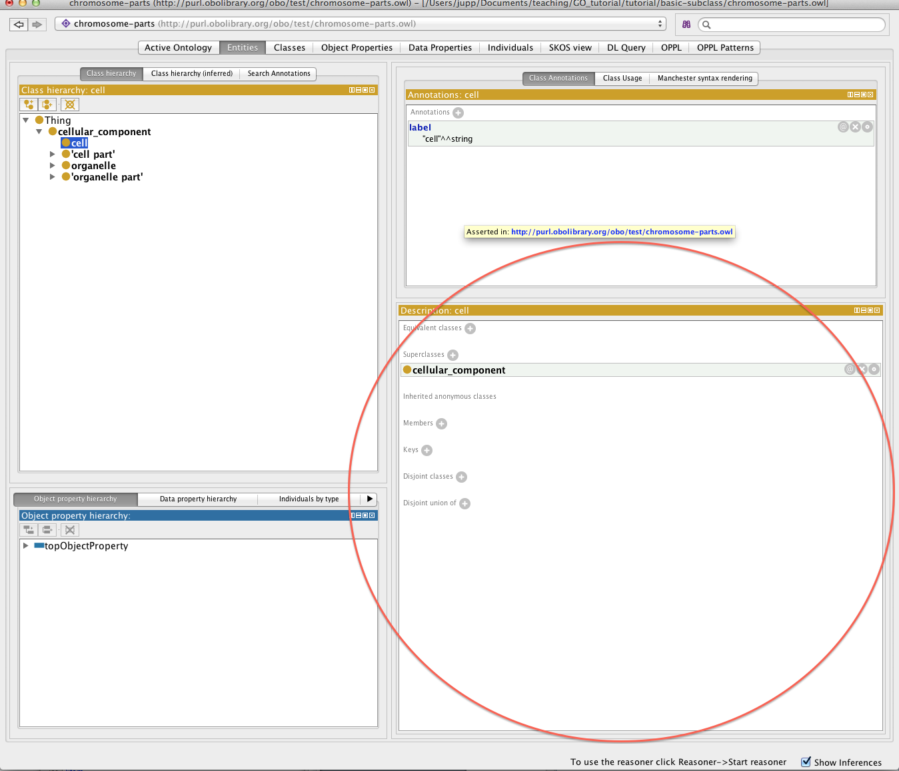
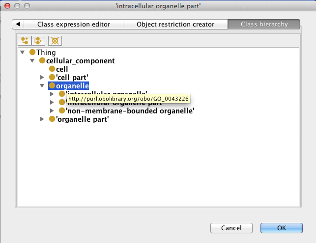
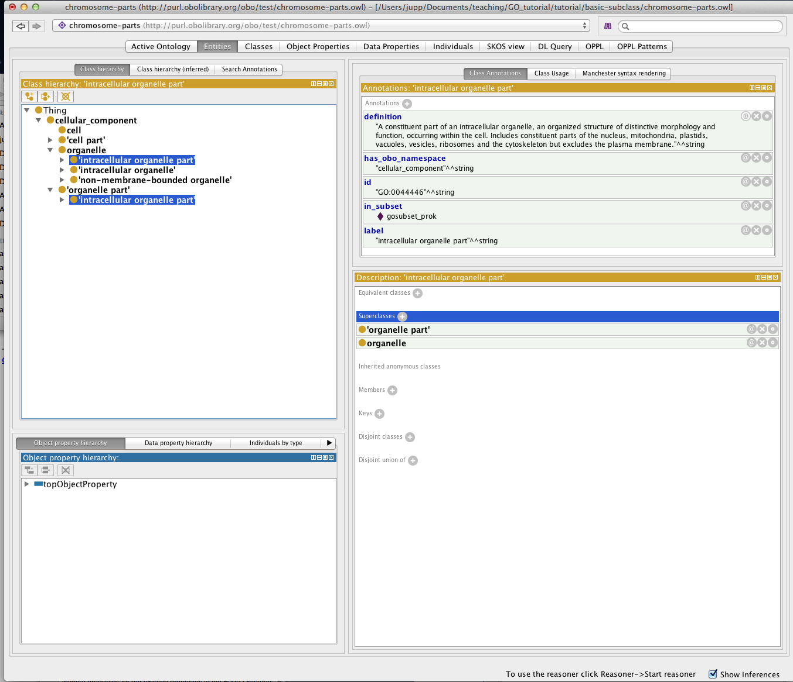

Class description view
======================

We have seen how to add subclasses in the class hierarchy. Another way to do the same thing is via the Class description view.

When an OWL class is selected in the entities view, the right hand side of the tab shows the class description panel. If we select the cell class we see in the class description view that this class has a superclass (cellular\_component). Using the + button we could add more superclasses to the cell class.

Select the ‘intracellular organelle part’ class in your ontology. Using the superclasses + button, add the ‘organelle’ class as a super class.

There are various ways to assert a superclass. The simplest it to just type in the class expression editor. Hint: Pressing CTRL + SPACE allows you to autocomplete on a term.

You can also use the class hierarchy tab here to search, browse and select the appropriate class.

The ‘intracellular organelle part’ class will now have two parents asserted in the class hierarchy. You will also be able to see both parents in the class description view.

