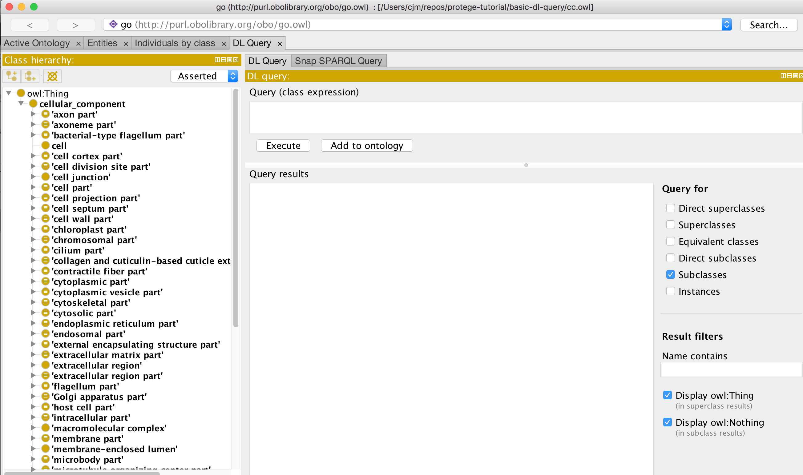
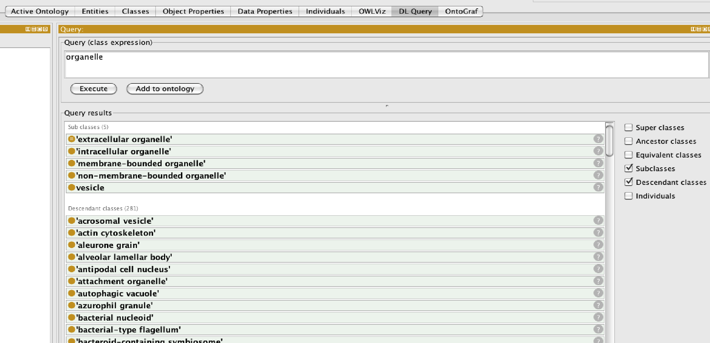
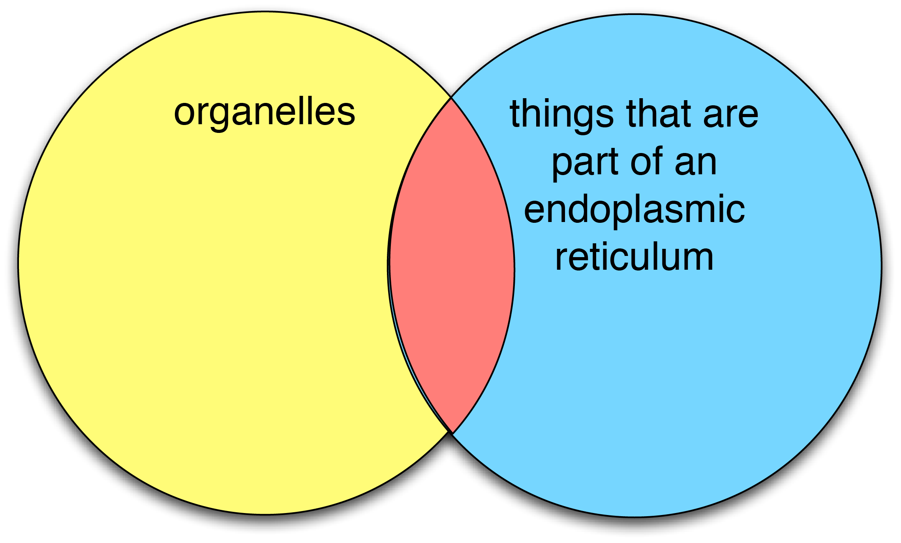
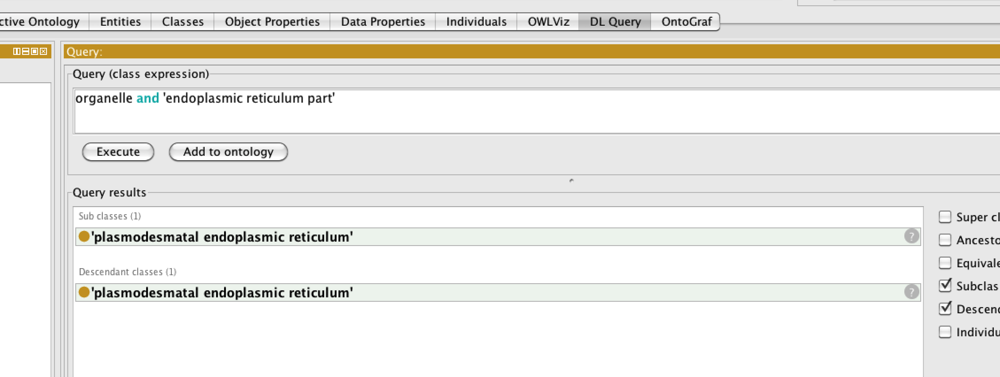
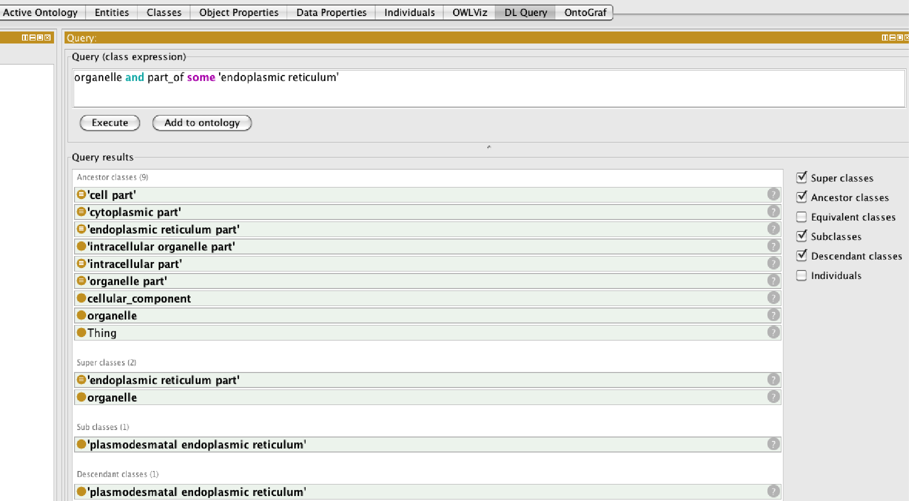
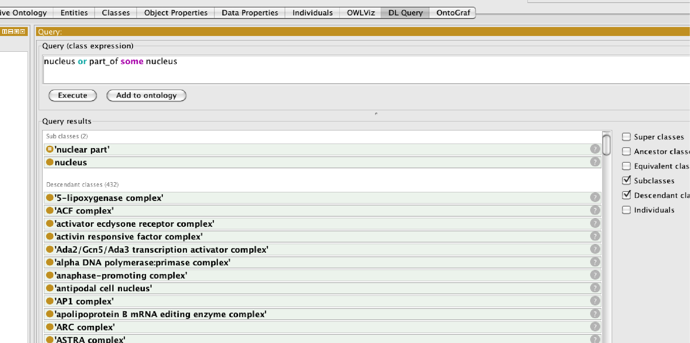
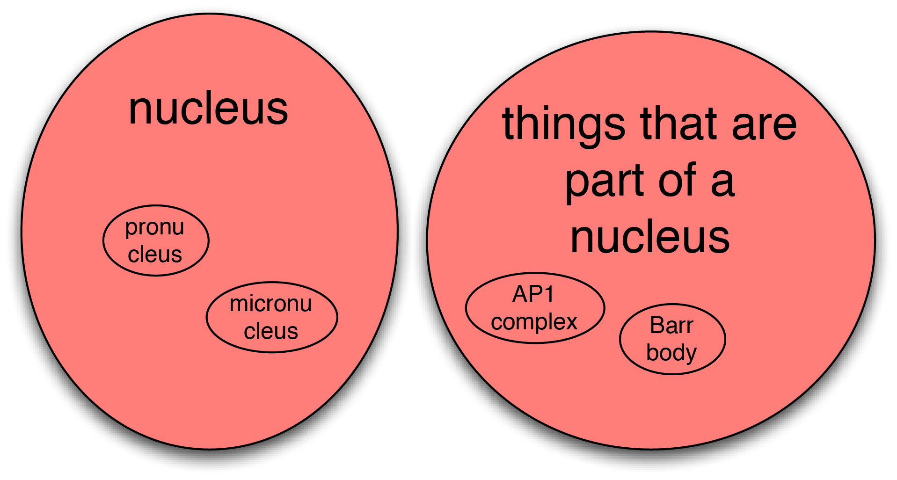

DL query tab
============

The DL query tab shown below provides an interface for querying and searching an ontology. The ontology must be classified by a reasoner before it can be queried in the DL query tab.

Go to the [“basic-dl-query”](https://github.com/geneontology/protege-tutorial/tree/master/basic-dl-query) folder and open “cc.owl”. Navigate to the DL Query tab.

Type “organelle” into the box, and make sure “subclasses” and “descendent classes” are ticked. “subclasses” is the direct subclasses calculated by the reasoner (which may often but not always be the same as the asserted subclasses). “descendants” is all subclasses.

In general for GO you should never need the “individuals” box ticked.

You can type any valid OWL class expression into the DL query tab. For example, to find all classes whose members are part\_of a membrane, type “part\_of some membrane”.

The OWL keyword “and” can be used to make a class expression that is the intersection of two class expressions. For example, to find the classes in the red area below, we want to find subclasses of the intersection of the class ‘organelle’ and the class ‘endoplasmic reticulum part’

Note that we do not need to use the “part” grouping classes in GO. The same results can be obtained by querying for the intersection of the class “organelle” and the restriction “part\_of some ER” – try this and see. We can also ask for superclasses by ticking the boxes above:

The ‘or’ keyword is to used to create a class expression that is the union of two class expressions. For example:

This is illustrated by the red area in the following Venn diagram:

## EXERCISE: Basic DL Queries

Go to the [basic-dl-query](https://github.com/geneontology/protege-tutorial/tree/master/basic-dl-query) folder in the tutorial directory and follow the instructions in the README.txt

