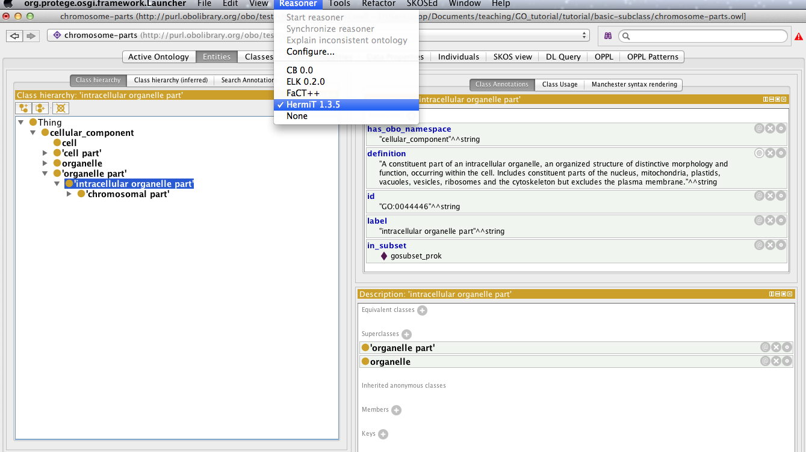

Disjointness
============

\[the instructors will describe the concept of disjoint classes here\]

At the top of our class hierarchy we have cell, cell part, organelle and organelle part. By default OWL assumes that these classes can overlap, i.e. there are individuals who can be instances of more than one of these classes. We want to create a restriction on our ontology that states these classes are different and that no individual can be a member of more than one of these classes. We can say this in OWL by creating a *disjoint classes* axiom.

We want to assert that organelle and ‘organelle part’ are disjoint. To do this first select the cell class. In the class description view select the + button next to disjoints. You can use CTRL to select multiple classes.

Note that the directionality is irrelevant.

Reasoning and inconsistency checking
------------------------------------

We have introduced a deliberate mistake into the ontology. We previously asserted that ‘intracellular organelle part’ is a subclass of both ‘organelle part’ and ‘organelle’. We have now added an axiom stating that ‘organelle’ and ‘organelle part’ are all disjoint. We can use the reasoner to check the consistency of our ontology. The reasoner should detect our contradiction.

Protégé comes with X reasoners, and more can be installed via the plugins mechanism (see plugins chapter). Select a reasoner from the Reasoner menu (HermiT, Pellet or Fact++ will work). Once a reasoner is highlighted, select “Start reasoner” from the menu.

A progress bar will indicate when classification is complete. The ‘intracellular organelle part’ class will have changed to red indicating that the class is now *unsatisfiable*.

You can also see unsatisfiable classes using the “Class hierarchy (inferred)” panel next to the “Class hierarchy” panel. Here you will a special class called Nothing. When we previously said that all OWL classes are sublasses of OWL Thing. OWL Nothing is a leaf class or bottom class of your ontology. Any classes that are deemed unsatisfiable by the reasoner are shown as sublasses or equivalent to OWL Nothing. The “class hierarchy (inferred)” view will show you all subclasses of Nothing.

One the ontology is classified inferred statements or axioms are shown in the various panels with a light yellow shading. The class description for ‘intracellular organelle part’ should look something like the following screen shot. You will see that the class has been asserted equivalent to the Nothing class. Inside this statement a small question mark icon appears, clicking this will get an explanation from the reasoner for this inconsistency.

Select the ? icon to get an explanation for this inconsistency. The explanation shows the axioms involved. We see the disjoint class axiom alongside the two subclass axioms are causing the inconsistency. We can simply repair this ontology by removing the ‘intracellular organelle part’ subClassOf ‘organelle’ axiom.

Remove the axiom, and resynchronise the reasoner from the reasoner menu.

EXERCISE: Basic Disjoint
========================

Go to the [basic-disjoint](../basic-disjoint) folder in the tutorial directory and follow the instructions in the README
