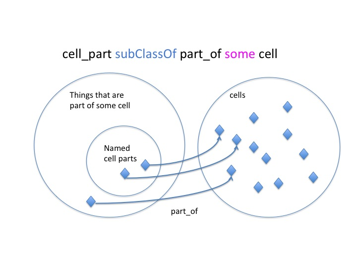
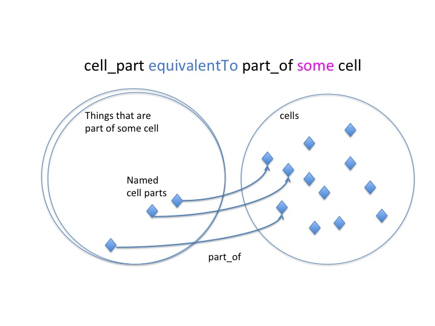

Equivalent classes
==================

The previous example showed the creation of a class restriction. These restrictions were asserted as superclass restrictions, and are sometimes known as *necessary conditions*. That is, if an individual is a member of the ‘cell part’ then it is necessary for it to also be related to a ‘cell’ along the ‘part of’ property.

Necessary conditions alone mean that individuals can exist that are part of a cell, but are not a type of ‘cell part’. In OWL we can make an even stronger statement and define the ‘cell part’ class as being equivalent to ‘part of’ some cell. This is known as a necessary and sufficient condition.

In Protégé we can create an equivalent class restriction inside the “Equivalent class’ slot of the class description view.

