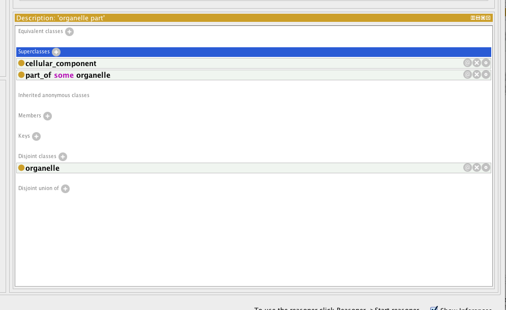
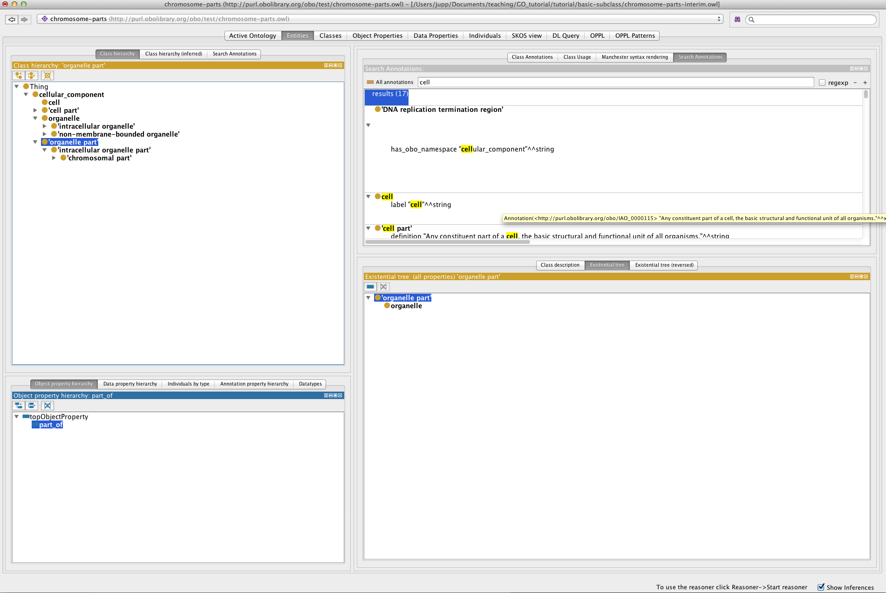

Object properties
=================

At this point load: .owl form the tutorial directory ‘basic-restriction’

We will now create an object property and use this to add some restriction onto classes. In OWL properties are used to assert relationships between individuals (or instance). Properties in OWL can have characteristics such as being transitive or symmetric. We can assert additional information about properties such their domain and range, along with defining inverse properties.

Create an object property
-------------------------

We will use the object property view circled below to create a part\_of property. In OWL all properties are a sub property of topObjectProperty.

Select the “add sub property button” circled below and name the property part\_of.

We can use the property description view shown below to make assertions about this property. We want to state that the part\_of property has the characteristic of being transitive. If a property is transitive, and the property relates individual a to individual b, and also individual b to individual c, then we can infer that individual a is related to individual c via property P. A good example of a transitive property is the geneological ‘ancestor of’ relationship. We can make a property transitive in Portege by simply selecting the transitive check box.

OWL class restrictions
======================

As previously stated, in OWL we use object property to describe binary relationships between two individuals (or instances). We can also use the properties to describe new classes (or sets of individuals) using *restrictions*. A restriction describes a class of individuals based on the relationships that members of the class participate in. In other words a restriction is a kind of class, in the same way that a named class is a kind of class.

For example, we can use a named class to capture all the individuals that are chromosome parts. But we could also describe the class of chromosome parts as all the instances that are ‘*part of’* a chromosome.

In OWL there are three main types of restrictions that can be placed on classes. These are **quantifier restriction**, **cardinality restrictions** and **hasValue** restriction. In this tutorial will initially focus on quantifier restrictions.

Quantifier restriction are further categorised into two types, the **existential** and the **universal** restriction.

-   **Existential** restrictions describe classes of individuals that participate in at least one relationship along a specified property to individuals that are members of a specified class. For example, “the class of individuals that have at least one (some) ‘part of’ relationship to members of the ‘Chromosome class”. In Protégé 4 the keyword ‘some’ is used to denote existential restrictions.

-   **Universal** restrictions describe classes of individuals that for a given property only have relationships along this property to individuals that are members of a specified class. For example, we can say a cellular component is capable of many functions using the existential quantifier, however, OWL semantics assume that there could be more. We can use the universal quantifier to add closure to the existential. That is we can assert that a cellular component is capable of these function, and is only capable of those function and no other. Another example is that the process of hair growth is found **only** in instances of the class Mammalia. In Protégé the keyword “only” is used.

In this tutorial we will deal exclusively with the existential (some) quantifier. Note that in OBO-Format, all relationships are implicitly existentially qualified.

Superclass restrictions
-----------------------

In OBO-Edit you will be familiar with creating relationships between classes. Strictly speaking in OWL you don’t make relationships between classes, however, using OWL restrictions we essentially achieve the same thing.

We want to capture the knowledge that the named class ‘organelle part’ is part of an organelle. In OWL speak, we want to say that every instance of an ‘organelle part’ is also an instance of the class of things that have at least one ‘part of’ relationship to an ‘organelle’. In OWL we do this by creating an existential restriction on the ‘organelle part’ class.

Select ‘organelle part’ in the class hierarchy and look at it’s current class description. At the top of this view there are two slots for defining equivalent classes and superclasses. ‘organelle part’ already has one superclass named cellular\_component.

We will create a restriction on ‘organelle part’ stating ‘organelle part’ has a *‘part of’* relationship to some ‘organelle’. Select the + icon next to the superclasses slot. We will define this anonymous superclass in Manchester OWL syntax as

‘part of’ some ‘organelle’.

The class restriction will be shown in the superclasses slot as follows.

Using Protégé create some of your own part\_of restriction the ‘cell part’, ‘intracellular part’ and ‘chromosomal part’ classes.

\[the instructors may elucidate more on the nature of these class restrictions here\]

NOTE: After each edit to the ontology you might want to synchronize the reasoner to make sure you didn’t introduce any inconsistencies into your ontology.

Existential tree plugin
-----------------------

The class hierarchy view in protégé shows subclass/superclass[2] relationships between classes. The default class hierarchy view is restricted to showing strict is-a, or sub/super class relationships. The existential tree is an alternate class hierarchy view that organise classes into hierarchies based on existential restriction. For example, viewing a partonomy along the ‘part of’ existential restriction.

The existential tree view can be found under Window -&gt; Views -&gt; Existential Tree

Drop the view over the class description view.

Select the ‘part of’ property to render your partonomy in the existential tree panel.

EXERCISE: Basic Restrictions
============================

Stay in the “basic-restriction” folder in the tutorial directory and follow the instructions in the README.txt

The instructors may demonstrate some of the additional options for navigating the ontology at this point:

-   Existential Tree Plugin

-   OntoGraf
