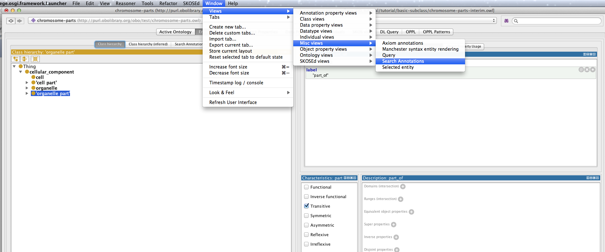

Protégé plugins
===============

Protégé is built on a plugin architecture. There is an activity community of developers writing plugin extensions to Protégé. There is a plugin library in Protégé that allows you to pick and install plugins. You may also find plugins elsewhere on the web that must be installed manually.

You can find the plugin library in the Protégé preferences. Select the check for downloads button to see the list of available plugins.

Install the Annotation Search View and the Existential tree view

Annotation search plugin
------------------------

Most plugins are either tabs, panels or menu items. The annotations search plugin provides a new panel that can be used to search through OWL annotations (such as labels and definitions). Tabs and panels can be found in the Window menu. Under Window -> Views -> Misc views -> annotation search. Once selected you can choose to drop this panel over any existing panel in Protégé. We recommend that you drop this panel to the right of the class hierarchy view, on top of the existing annotation view panel.

You can use the annotation search panel to search through all annotation, or restrict it to individual annotations, such as the label. The annotation view also supports regular expression queries.
