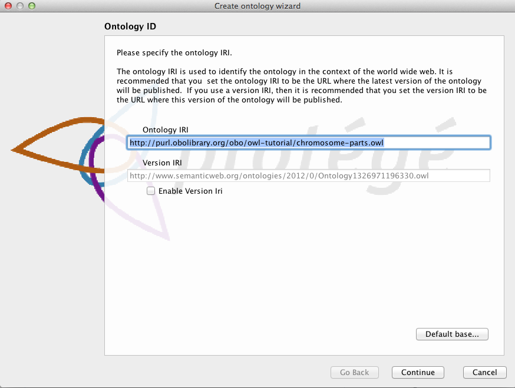

Starting Protégé
================

When you start Protégé a welcome dialog appears where you can choose to

 1. Create a new OWL ontology
 2. Open an existing OWL ontology
 3. Open an ontology from a particular URI (e.g <http://purl.obolibrary.org/obo/go.owl>).

We will begin by selecting “Create new Ontology”. In the next dialog we will create an IRI that can be used to identify our ontology on the Web. You can set the IRI to anything you want at this stage, for this tutorial we will use <http://purl.obolibrary.org/obo/owl-tutorial/chromosome-parts.owl>.

You will also want to save this ontology file to your hard disk. Use the next dialog to save the ontology file somewhere convenient. Finally you will want to choose a format for your ontology file. Protégé allows you to save your ontology in a variety of OWL formats, including the OBO file format. We recommend that you save your ontology in RDF/XML, as this is the most stable format to work with in Protégé. You can always choose to export your file in one of the other formats later.

The Protégé UI
--------------

After a few second Protégé will launch into the main user interface. The protégé interface follows a basic paradigm of Tabs and Panels. The layout of tabs and panels is configurable by the user. By default protégé launches with 5 main tabs.

The first tab you see is the Active Ontology tab. Here you will find some basic meta-data about the ontology you are viewing. At the very top you see the IRI and file name of the active ontology you are viewing. Protégé allows you to work with multiple ontologies at once (See later), so this top bar is very important as it lets you know which ontology you are viewing and editing.

The panel on the left is the ontology annotations panel. You can use this panel to add basic meta-data to your ontology, such as the creation date, the authors and a short description.
