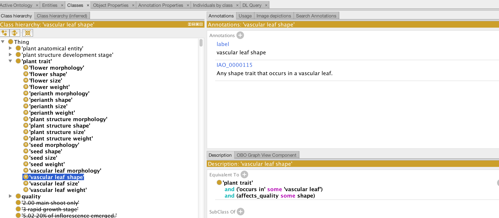
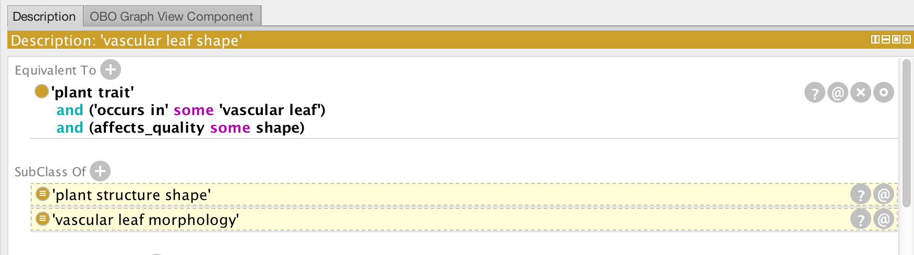

Making Ontologies from Spreadsheets and templates (Optional)
=================================================

Go to the [template-examples](../template-examples) folder

Open “test1.csv” in Excel. This has a sample set of plant traits

If you have python installed, you can convert this to OWL:

./apply-pattern.py -p simple\_measurable.yaml –i test1.csv &gt; test1.owl

Otherwise, just use the existing “test1.owl” file in the directory.

Open this in Protégé and look under plant trait. You should see a flat list of terms. You can navigate to one and look at the description tab. As you can see, the values from the spreadsheet have been slotted in as specific object property restrictions:

Next, turn on the reasoner. You will see superclasses show up in yellow. These are **inferred superclasses**.

Navigate to “Class hierarchy (inferred)”

You will see the entire polyhierarchy is inferred automatically
