Protégé 5 tutorial for GO Editors. V2

Table of Contents
=================

Initial Preparation 4

Starting Protégé 4

The Protégé UI 6

The entities tab 9

Creating your first class 10

Renaming an entity 12

New entities 13

Adding annotations properties 14

Setting label rendering 15

Protégé plugins 17

Annotation search plugin 18

Creating the class hierarchy 18

EXERCISE: Basic Subclass Hierarchy 19

Class description view 19

Disjointness 23

Reasoning and inconsistency checking 24

EXERCISE: Basic Disjoint 27

Object properties 27

Create an object property 27

OWL class restrictions 29

Superclass restrictions 30

Existential tree plugin 32

EXERCISE: Basic Restrictions 33

DL query tab 34

EXERCISE: Basic DL Queries 37

Equivalent classes 37

39

Automatic classification 39

EXERCISE: Basic classification 39

Property chains 39

Do a DL query for cell cycle processes that occur in a nucleus – note there is only one result: 40

40

42

EXERCISE: regulation-classification 42

Imports 42

EXERCISE: response to stimulus 43

Ontology libraries 44

45

svn externals and ontology libraries 46

Using OBO-Edit and Protégé 4 together 47

EXERCISE: obo-owl classification 47

GO Ontology Extensions 47

Initial Preparation
===================

**GitHub Login:**

Obtain a login at GitHub (https://github.com/) and send Laurel your login name so you can be added to the GO Organization (https://github.com/geneontology).  This is our repository for ontology files and issue trackers.

**Install Protege 5 for Ontology Development **

Download and install the latest version of Protege (5.1) for ontology development.

http://protege.stanford.edu/products.php\#desktop-protege

The exercises assume that you have the tutorial directory checked out from GitHub. If for some reason you’re unable to do this, you can download individual files from:

<https://github.com/geneontology/protege-tutorial>

Starting Protégé
================

When you start Protégé a welcome dialog appears where you can choose to 1) Create a new OWL ontology, 2) Open an existing OWL ontology, 3) Open an ontology from a particular URI (e.g http://purl.obolibrary.org/obo/go.owl).

We will begin by selecting “Create new Ontology”. In the next dialog we will create an IRI that can be used to identify our ontology on the Web. You can set the IRI to anything you want at this stage, for this tutorial we will use <http://purl.obolibrary.org/obo/owl-tutorial/chromosome-parts.owl>.

You will also want to save this ontology file to your hard disk. Use the next dialog to save the ontology file somewhere convenient. Finally you will want to choose a format for your ontology file. Protégé allows you to save your ontology in a variety of OWL formats, including the OBO 1.2 flat file format. We recommend that you save your ontology in RDF/XML, as this is the most stable format to work with in Protégé. You can always choose to export your file in one of the other formats later.

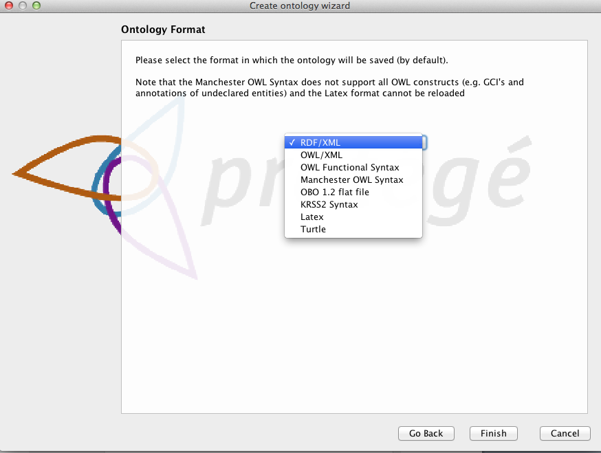

The Protégé UI
--------------

After a few second Protégé will launch into the main user interface. The protégé interface follows a basic paradigm of Tabs and Panels. The layout of tabs and panels is configurable by the user. By default protégé launches with 5 main tabs.

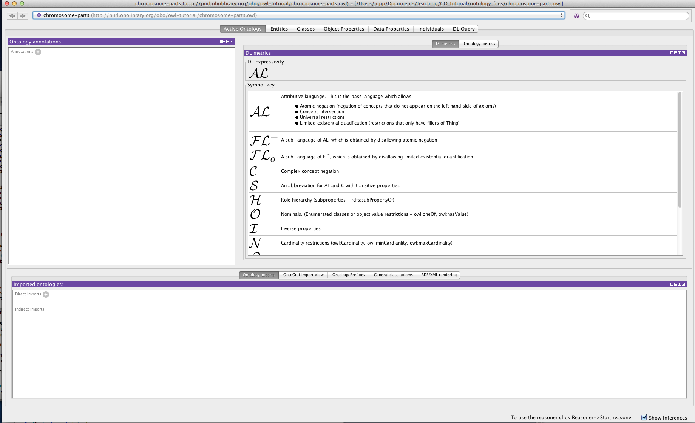

The first tab you see is the Active Ontology tab. Here you will find some basic meta-data about the ontology you are viewing. At the very top you see the IRI and file name of the active ontology you are viewing. Protégé allows you to work with multiple ontologies at once (See later), so this top bar is very important as it lets you know which ontology you are viewing and editing.

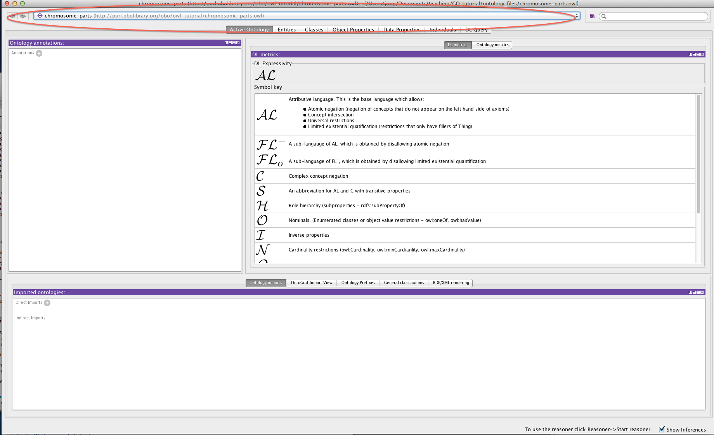

The panel on the left is the ontology annotations panel. You can use this panel to add basic meta-data to your ontology, such as the creation date, the authors and a short description.

The entities tab
================

You will see along the top of the screen various tabs. Each tab provides a different perspective on the ontology. For example, the classes tab allows us to view and edit the classes in the ontology, and similarly the properties tab focuses on the properties in the ontology. The primary tab where you will spend most of your time is the entities tab.

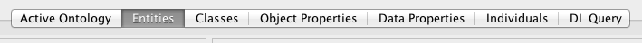

Select the entities tab and then select the Thing class. Thing is the root class for all OWL ontologies and it cannot be deleted in Protégé.

The entities tab is split into two halves. The left hand side provides a suite of panels for selecting various entities in your ontology. When a particular entity is selected the panels on the right hand side displays information about that entity. The entities panel is context specific, so if you have a class selected (like Thing) then the panels on the right are aimed at editing classes.

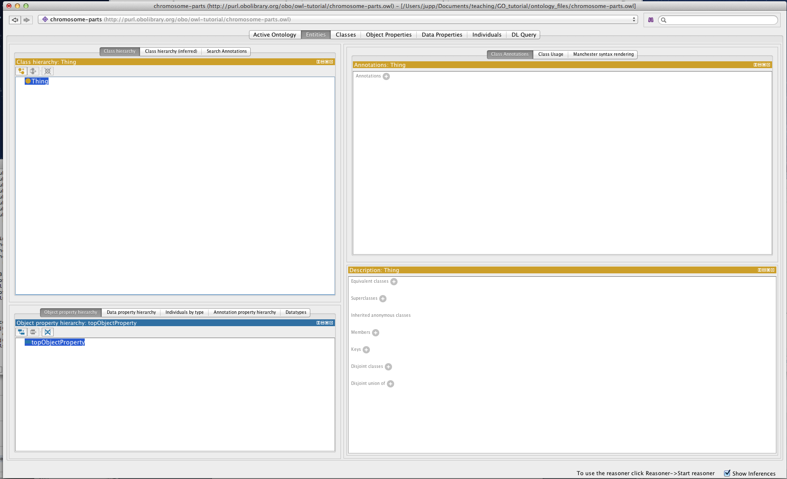

If you select the topObjectProperty property in the panel at the bottom, the right hand side panels will change context.

Creating your first class
-------------------------

By far the most common panel for working with your ontology is the Class hierarchy panel.

There are three button at the top of the class hierarchy view. These allow you to add a subclass, add a sibling or delete a selected class. We will use the add subclass button to add a child class to OWL thing. For now, simply name this class cellular\_component.

The class should have been created as follows. By default Protégé will use the ontology IRI, followed by a \#, followed by your specified name (replacing spaces with underscores) as the the unique IRI for this entity. If you hover over this class with your mouse you will see the full IRI for this class

Renaming an entity
------------------

We can change the IRI for a concept using the rename function in the refactoring menu. Rename the cellular\_component class to use its proper IRI from the Gene Ontology (<http://purl.obolibrary.org/obo/GO_0005575>)

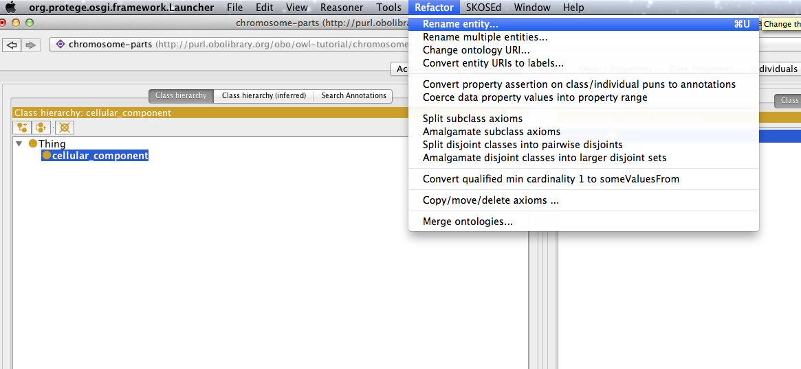

Make sure the check the “Show full IRI” box so you can edit the full IRI.

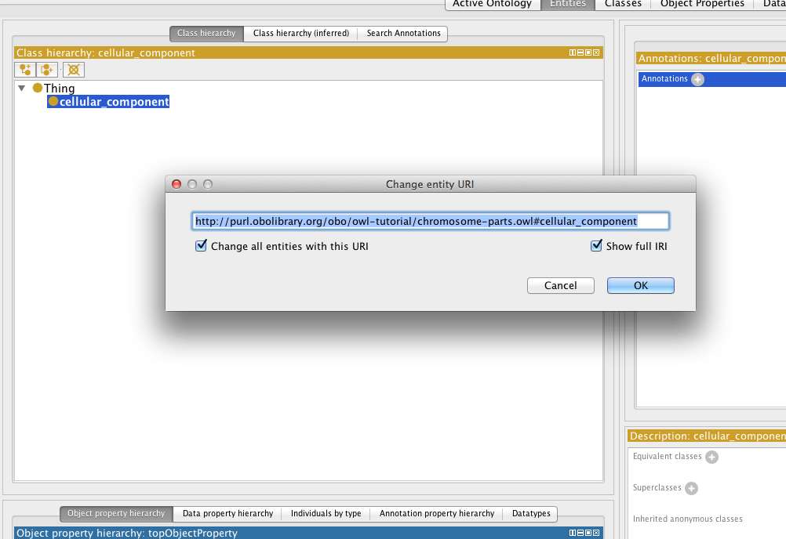

And then paste or type in the correct GO URI.

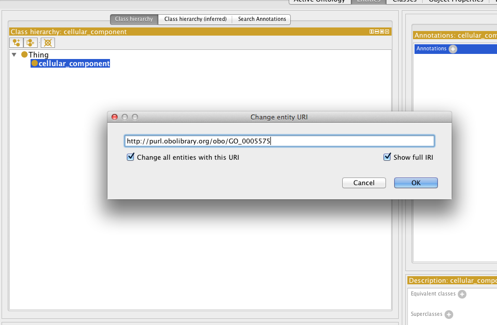

Now the correct GO URI appears in the ontology. Obviously you don’t want to have to rename every entity you create when building your own ontology. Luckily Protégé provides a “New Entities” preferences panel where you can specify how new IRI should be created.

New entities
------------

Terms in the ontologies we use have separate names and IDs. The names are annotation values (labels) and the ids are represented using IRIs. The OBO foundry has a policy on IRI (or id) generation. You can set an id strategy using the “New Entities” tab under the Protégé preferences.

[*http://www.obofoundry.org/id-policy.shtml*](http://www.obofoundry.org/id-policy.shtml)

Set your new entity preferences as follows:

For ontologies other than GO, change the value of the prefix. Note that all OBO library ontologies should use the obolibrary.org Specified URI value.

Adding annotations properties
-----------------------------

You can add annotations (such as labels, descriptions, xrefs etc..) to any OWL entity using Protégé. The panel on the right, named Annotations is where these annotations are added. Use this panel to add a “cellular\_component” label to the class you created previously.

Select the + button to add an annotation to the selected entity. Protégé has a set of built in annotation properties, such as label and comment – add a comment such as “created during Berkeley tutorial”. You can also create your own annotation properties.

Note that for practical purposes you will start from an existing OWL file that will include a pre-declared set of annotation properties such as ‘has exact synonym’ and ‘definition’. You may never need to create your own annotation properties.

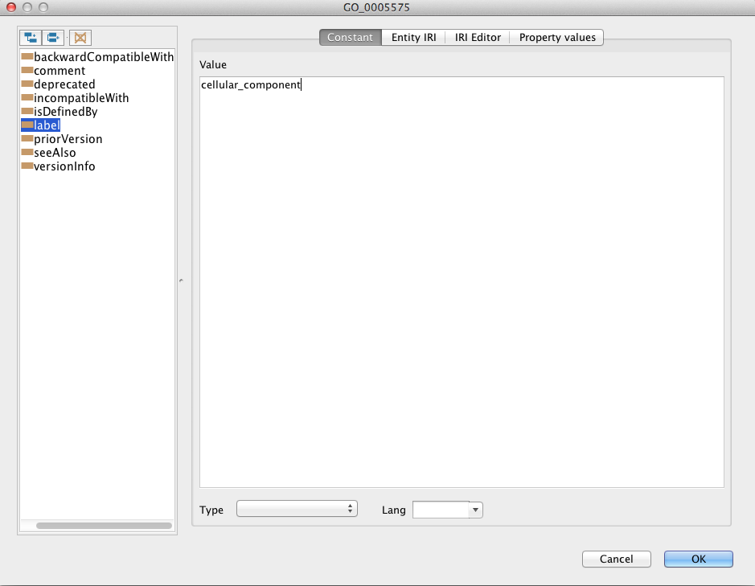

Setting label rendering
-----------------------

You can change how Protégé renders entities. It is common to want to view entities by the their label, rather than identifiers. You can tell protégé to render on any annotation property you choose. Lets render all entities by their class label.

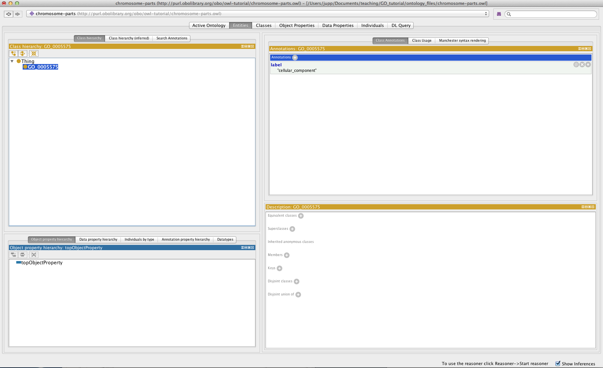

In the view menu choose render by label

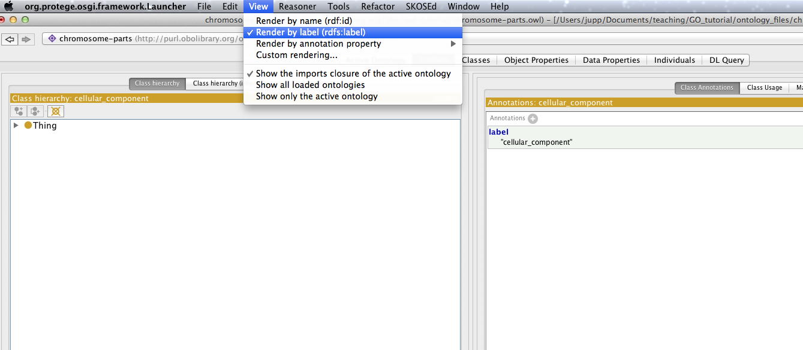

The cellular\_component class will now render in the hierarchy view using the value of the label annotation property.

Creating the class hierarchy
----------------------------

We will now create a simple class hierarchy. In protégé ‘class hierarchy’ typically refers to a sub/superclass hierarchy (also known as an is\_a hierarchy in OBO-Edit). We will return to relations such as ‘part of’ later on in this tutorial. For now, we will take advantage of the fact that the GO cell component ontology allows us to bypass this for now by means of classes such as ‘cell part’ and ‘nuclear part’.

Using the class hierarchy view create a small section of the cellular component branch of the GO as shown in the following screenshot. Play around with add subclass, add sibling and the drag and drop functionality.

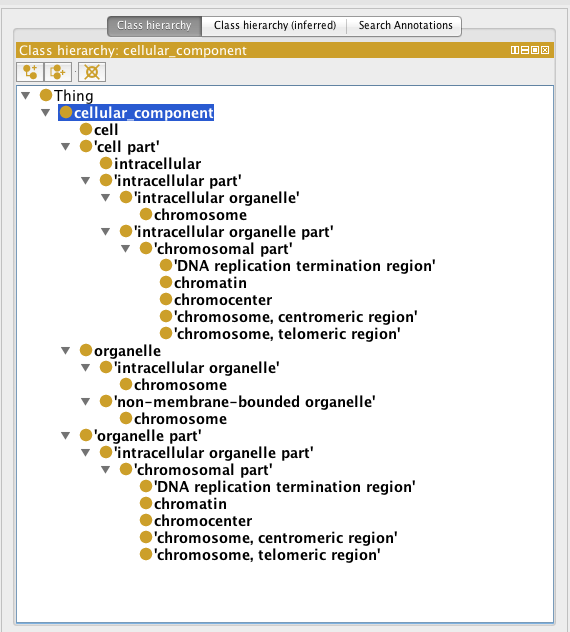

Don’t bother to add textual definitions, synonyms etc at this stage.

After you have become familiar, you can save your efforts or discard them – you won’t need this ontology from here on.

EXERCISE: Basic Subclass Hierarchy
==================================

Go to the directory “basic-subclass” in the tutorial folder and open [chromosome-parts.owl](http://oboformat.googlecode.com/svn/docs/tutorial/basic-subclass/chromosome-parts.owl)

Follow the instructions in the README.md file

Class description view
======================

We have seen how to add subclasses in the class hierarchy. Another way to do the same thing is via the Class description view.

When an OWL class is selected in the entities view, the right hand side of the tab shows the class description panel. If we select the cell class we see in the class description view that this class has a superclass (cellular\_component). Using the + button we could add more superclasses to the cell class.

Select the ‘intracellular organelle part’ class in your ontology. Using the superclasses + button, add the ‘organelle’ class as a super class.

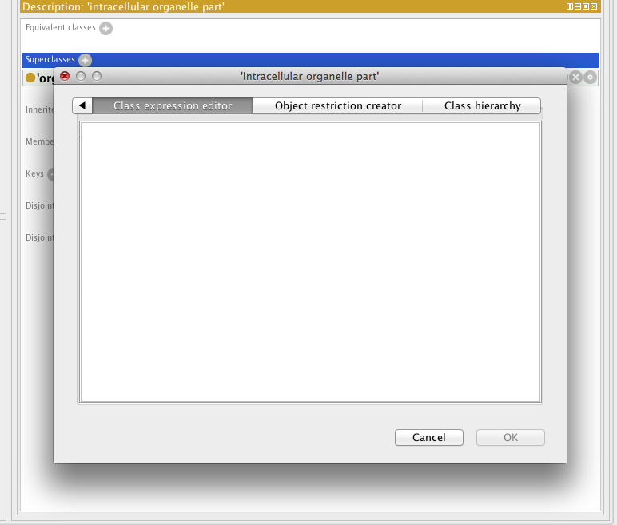

There are various ways to assert a superclass. The simplest it to just type in the class expression editor. Hint: Pressing CTRL + SPACE allows you to autocomplete on a term.

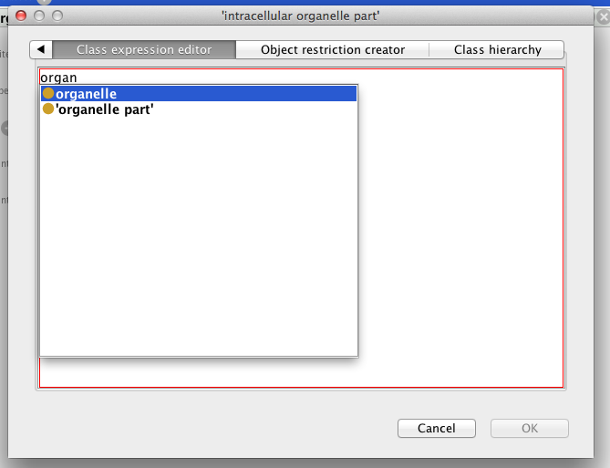

You can also use the class hierarchy tab here to search, browse and select the appropriate class.

The ‘intracellular organelle part’ class will now have two parents asserted in the class hierarchy. You will also be able to see both parents in the class description view.

Protégé plugins
===============

Protégé is built on a plugin architecture. There is an activity community of developers writing plugin extensions to Protégé. There is a plugin library in Protégé that allows you to pick and install plugins. Yu may also find plugins elsewhere on the web that must be installed manually[1].

You can find the plugin library in the Protégé preferences. Select the check for downloads button to see the list of available plugins.

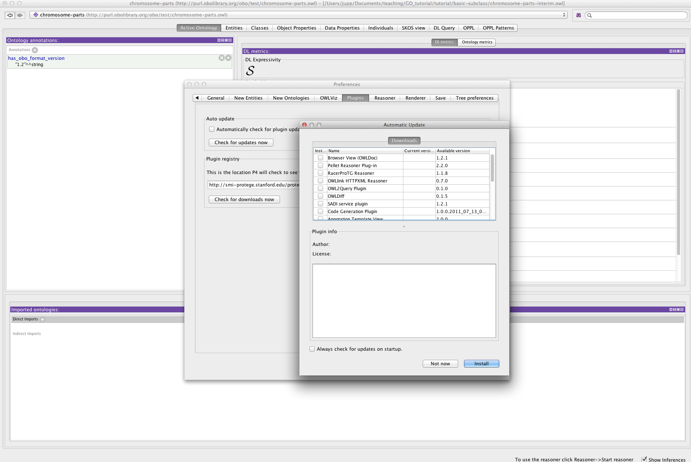

Install the Annotation Search View and the Existential tree view

Annotation search plugin
------------------------

Most plugins are either tabs, panels or menu items. The annotations search plugin provides a new panel that can be used to search through OWL annotations (such as labels and definitions). Tabs and panels can be found in the Window menu. Under Window -&gt; Views -&gt; Misc views -&gt; annotation search. Once selected you can choose to drop this panel over any existing panel in Protégé. We recommend that you drop this panel to the right of the class hierarchy view, on top of the existing annotation view panel.

You can use the annotation search panel to search through all annotation, or restrict it to individual annotations, such as the label. The annotation view also supports regular expression queries.

Disjointness
============

\[the instructors will describe the concept of disjoint classes here\]

At the top of our class hierarchy we have cell, cell part, organelle and organelle part. By default OWL assumes that these classes can overlap, i.e. there are individuals who can be instances of more than one of these classes. We want to create a restriction on our ontology that states these classes are different and that no individual can be a member of more than one of these classes. We can say this in OWL by creating a *disjoint classes* axiom.

We want to assert that organelle and ‘organelle part’ are disjoint. To do this first select the cell class. In the class description view select the + button next to disjoints. You can use CTRL to select multiple classes.

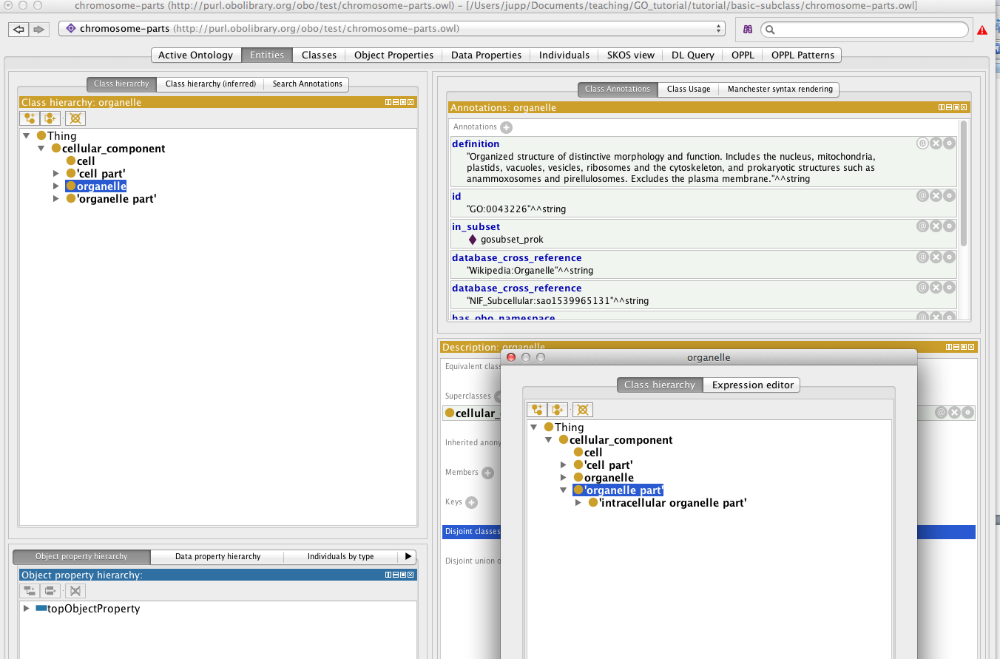

Note that the directionality is irrelevant.

Reasoning and inconsistency checking
------------------------------------

We have introduced a deliberate mistake into the ontology. We previously asserted that ‘intracellular organelle part’ is a subclass of both ‘organelle part’ and ‘organelle’. We have now added an axiom stating that ‘organelle’ and ‘organelle part’ are all disjoint. We can use the reasoner to check the consistency of our ontology. The reasoner should detect our contradiction.

Protégé comes with X reasoners, and more can be installed via the plugins mechanism (see plugins chapter). Select a reasoner from the Reasoner menu (HermiT, Pellet or Fact++ will work). Once a reasoner is highlighted, select “Start reasoner” from the menu.

A progress bar will indicate when classification is complete. The ‘intracellular organelle part’ class will have changed to red indicating that the class is now *unsatisfiable*.

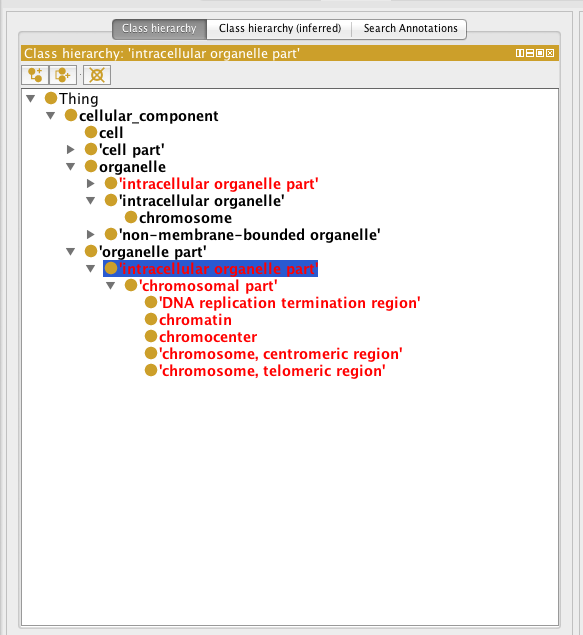

You can also see unsatisfiable classes using the “Class hierarchy (inferred)” panel next to the “Class hierarchy” panel. Here you will a special class called Nothing. When we previously said that all OWL classes are sublasses of OWL Thing. OWL Nothing is a leaf class or bottom class of your ontology. Any classes that are deemed unsatisfiable by the reasoner are shown as sublasses or equivalent to OWL Nothing. The “class hierarchy (inferred)” view will show you all subclasses of Nothing.

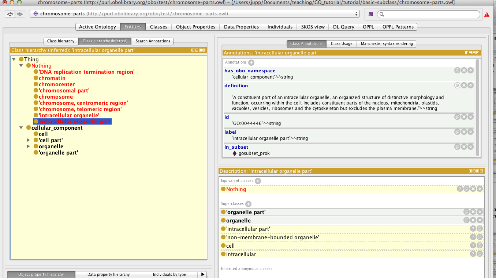

One the ontology is classified inferred statements or axioms are shown in the various panels with a light yellow shading. The class description for ‘intracellular organelle part’ should look something like the following screen shot. You will see that the class has been asserted equivalent to the Nothing class. Inside this statement a small question mark icon appears, clicking this will get an explanation from the reasoner for this inconsistency.

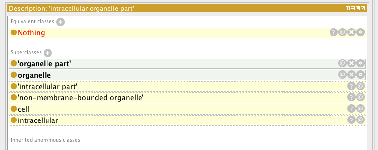

Select the ? icon to get an explanation for this inconsistency. The explanation shows the axioms involved. We see the disjoint class axiom alongside the two subclass axioms are causing the inconsistency. We can simply repair this ontology by removing the ‘intracellular organelle part’ subClassOf ‘organelle’ axiom.

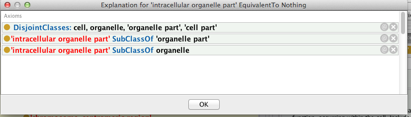

Remove the axiom, and resynchronise the reasoner from the reasoner menu.

EXERCISE: Basic Disjoint
========================

Go to the “basic-disjoint” folder in the tutorial directory and follow the instructions in the README.txt

Making Ontologies from Spreadsheets and templates
=================================================

Go to the “template-examples” folder

Open “test1.csv” in Excel. This has a sample set of plant traits

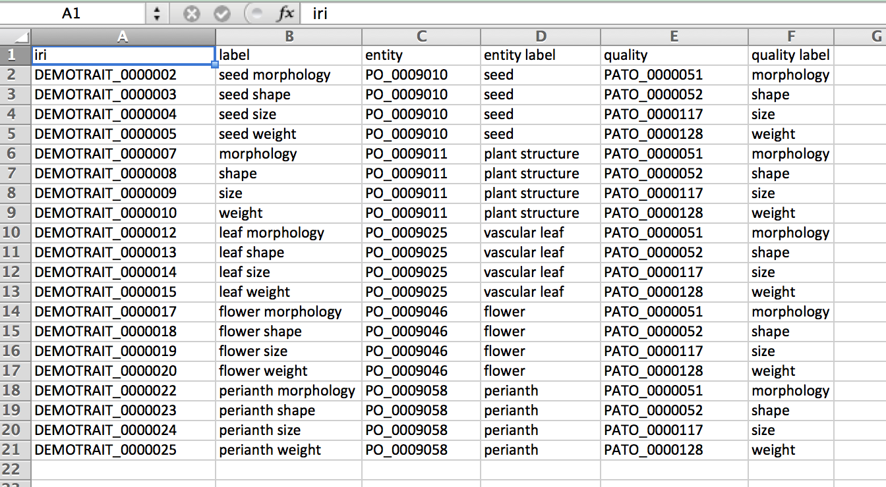

If you have python installed, you can convert this to OWL:

./apply-pattern.py -p simple\_measurable.yaml –i test1.csv &gt; test1.owl

Otherwise, just use the existing “test1.owl” file in the directory.

Open this in Protégé and look under plant trait. You should see a flat list of terms. You can navigate to one and look at the description tab. As you can see, the values from the spreadsheet have been slotted in as specific object property restrictions:

Next, turn on the reasoner. You will see superclasses show up in yellow. These are **inferred superclasses**.

Navigate to “Class hierarchy (inferred)”

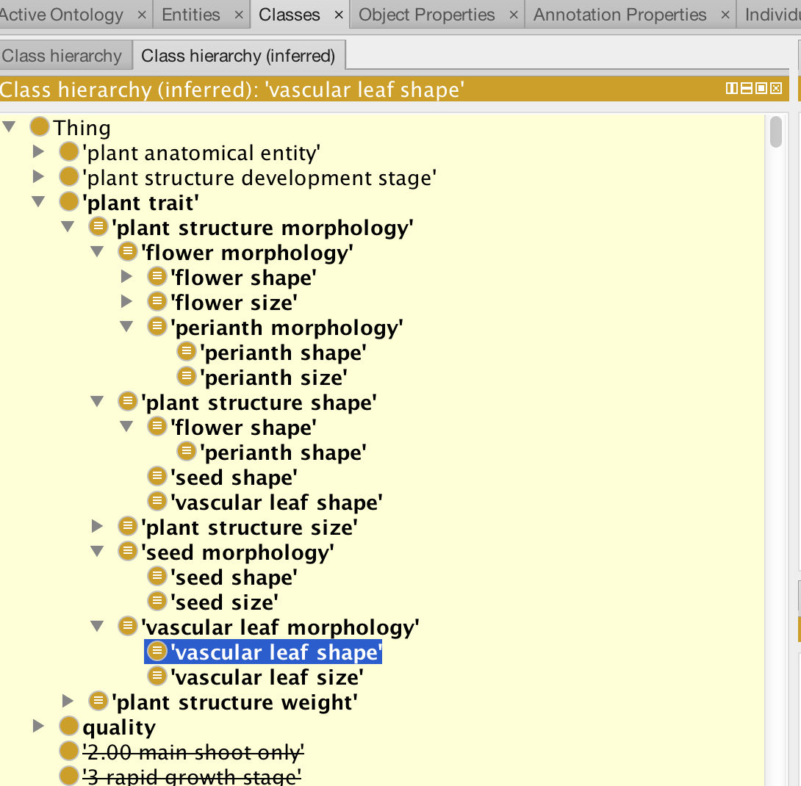

You will see the entire polyhierarchy is inferred automatically

Object properties
=================

At this point load: .owl form the tutorial directory ‘basic-restriction’

We will now create an object property and use this to add some restriction onto classes. In OWL properties are used to assert relationships between individuals (or instance). Properties in OWL can have characteristics such as being transitive or symmetric. We can assert additional information about properties such their domain and range, along with defining inverse properties.

Create an object property
-------------------------

We will use the object property view circled below to create a part\_of property. In OWL all properties are a sub property of topObjectProperty.

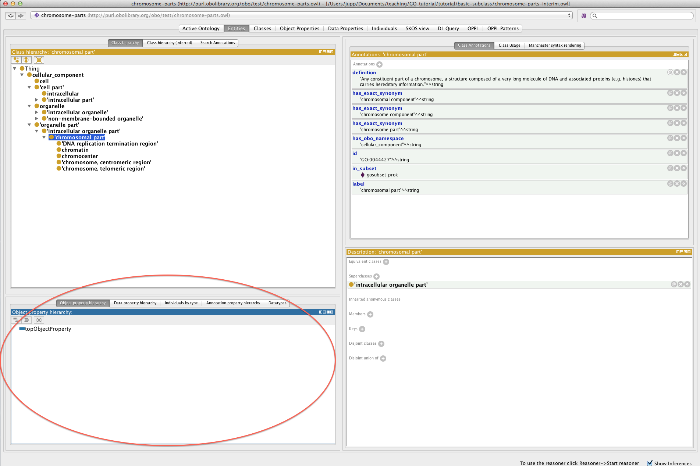

Select the “add sub property button” circled below and name the property part\_of.

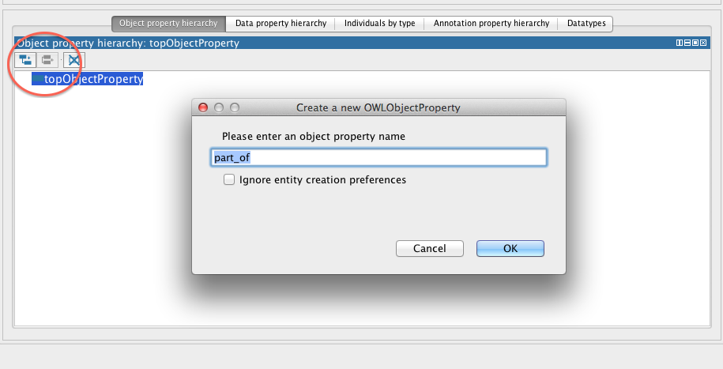

We can use the property description view shown below to make assertions about this property. We want to state that the part\_of property has the characteristic of being transitive. If a property is transitive, and the property relates individual a to individual b, and also individual b to individual c, then we can infer that individual a is related to individual c via property P. A good example of a transitive property is the geneological ‘ancestor of’ relationship. We can make a property transitive in Portege by simply selecting the transitive check box.

OWL class restrictions
======================

As previously stated, in OWL we use object property to describe binary relationships between two individuals (or instances). We can also use the properties to describe new classes (or sets of individuals) using *restrictions*. A restriction describes a class of individuals based on the relationships that members of the class participate in. In other words a restriction is a kind of class, in the same way that a named class is a kind of class.

For example, we can use a named class to capture all the individuals that are chromosome parts. But we could also describe the class of chromosome parts as all the instances that are ‘*part of’* a chromosome.

In OWL there are three main types of restrictions that can be placed on classes. These are **quantifier restriction**, **cardinality restrictions** and **hasValue** restriction. In this tutorial will initially focus on quantifier restrictions.

Quantifier restriction are further categorised into two types, the **existential** and the **universal** restriction.

-   **Existential** restrictions describe classes of individuals that participate in at least one relationship along a specified property to individuals that are members of a specified class. For example, “the class of individuals that have at least one (some) ‘part of’ relationship to members of the ‘Chromosome class”. In Protégé 4 the keyword ‘some’ is used to denote existential restrictions.

-   **Universal** restrictions describe classes of individuals that for a given property only have relationships along this property to individuals that are members of a specified class. For example, we can say a cellular component is capable of many functions using the existential quantifier, however, OWL semantics assume that there could be more. We can use the universal quantifier to add closure to the existential. That is we can assert that a cellular component is capable of these function, and is only capable of those function and no other. Another example is that the process of hair growth is found **only** in instances of the class Mammalia. In Protégé the keyword “only” is used.

In this tutorial we will deal exclusively with the existential (some) quantifier. Note that in OBO-Format, all relationships are implicitly existentially qualified.

Superclass restrictions
-----------------------

In OBO-Edit you will be familiar with creating relationships between classes. Strictly speaking in OWL you don’t make relationships between classes, however, using OWL restrictions we essentially achieve the same thing.

We want to capture the knowledge that the named class ‘organelle part’ is part of an organelle. In OWL speak, we want to say that every instance of an ‘organelle part’ is also an instance of the class of things that have at least one ‘part of’ relationship to an ‘organelle’. In OWL we do this by creating an existential restriction on the ‘organelle part’ class.

Select ‘organelle part’ in the class hierarchy and look at it’s current class description. At the top of this view there are two slots for defining equivalent classes and superclasses. ‘organelle part’ already has one superclass named cellular\_component.

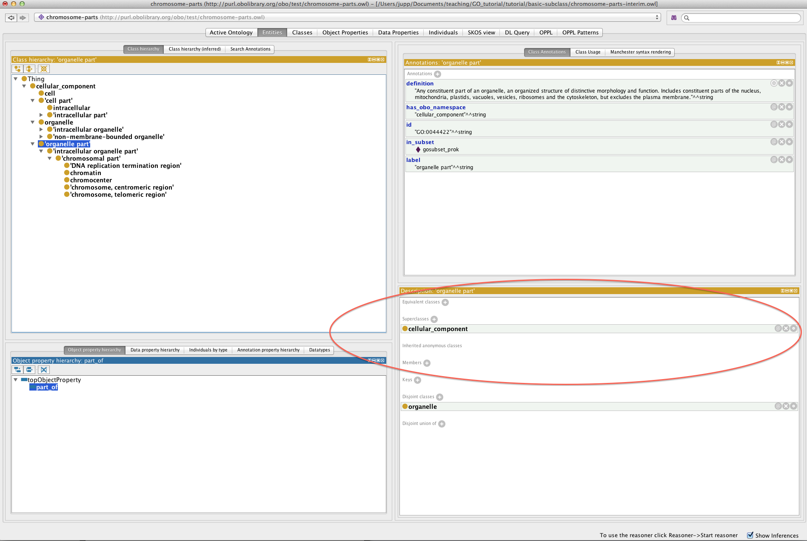

We will create a restriction on ‘organelle part’ stating ‘organelle part’ has a *‘part of’* relationship to some ‘organelle’. Select the + icon next to the superclasses slot. We will define this anonymous superclass in Manchester OWL syntax as

‘part of’ some ‘organelle’.

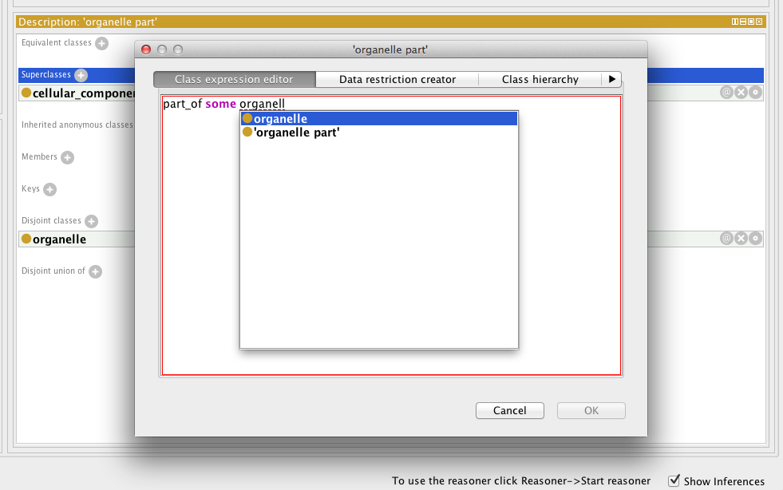

The class restriction will be shown in the superclasses slot as follows.

Using Protégé create some of your own part\_of restriction the ‘cell part’, ‘intracellular part’ and ‘chromosomal part’ classes.

\[the instructors may elucidate more on the nature of these class restrictions here\]

NOTE: After each edit to the ontology you might want to synchronize the reasoner to make sure you didn’t introduce any inconsistencies into your ontology.

Existential tree plugin
-----------------------

The class hierarchy view in protégé shows subclass/superclass[2] relationships between classes. The default class hierarchy view is restricted to showing strict is-a, or sub/super class relationships. The existential tree is an alternate class hierarchy view that organise classes into hierarchies based on existential restriction. For example, viewing a partonomy along the ‘part of’ existential restriction.

The existential tree view can be found under Window -&gt; Views -&gt; Existential Tree

Drop the view over the class description view.

Select the ‘part of’ property to render your partonomy in the existential tree panel.

EXERCISE: Basic Restrictions
============================

Stay in the “basic-restriction” folder in the tutorial directory and follow the instructions in the README.txt

The instructors may demonstrate some of the additional options for navigating the ontology at this point:

-   Existential Tree Plugin

-   OntoGraf

DL query tab
============

The DL query tab shown below provides an interface for querying and searching an ontology. The ontology must be classified by a reasoner before it can be queried in the DL query tab.

Go to the “basic-dl-query” folder and open “cc.owl”. Navigate to the DL Query tab.

Type “organelle” into the box, and make sure “subclasses” and “descendent classes” are ticked. “subclasses” is the direct subclasses calculated by the reasoner (which may often but not always be the same as the asserted subclasses). “descendants” is all subclasses.

In general for GO you should never need the “individuals” box ticked.

You can type any valid OWL class expression into the DL query tab. For example, to find all classes whose members are part\_of a membrane, type “part\_of some membrane”.

 
-

The OWL keyword “and” can be used to make a class expression that is the intersection of two class expressions. For example, to find the classes in the red area below, we want to find subclasses of the intersection of the class ‘organelle’ and the class ‘endoplasmic reticulum part’

Note that we do not need to use the “part” grouping classes in GO. The same results can be obtained by querying for the intersection of the class “organelle” and the restriction “part\_of some ER” – try this and see. We can also ask for superclasses by ticking the boxes above:

The ‘or’ keyword is to used to create a class expression that is the union of two class expressions. For example:

This is illustrated by the red area in the following Venn diagram:

EXERCISE: Basic DL Queries
==========================

Go to the “basic-dl-query” folder in the tutorial directory and follow the instructions in the README.txt

Equivalent classes
------------------

The previous example showed the creation of a class restriction. These restrictions were asserted as superclass restrictions, and are sometimes known as *necessary conditions*. That is, if an individual is a member of the ‘cell part’ then it is necessary for it to also be related to a ‘cell’ along the ‘part of’ property.

Necessary conditions alone mean that individuals can exist that are part of a cell, but are not a type of ‘cell part’. In OWL we can make an even stronger statement and define the ‘cell part’ class as being equivalent to ‘part of’ some cell. This is known as a necessary and sufficient condition.

In Protégé we can create an equivalent class restriction inside the “Equivalent class’ slot of the class description view.

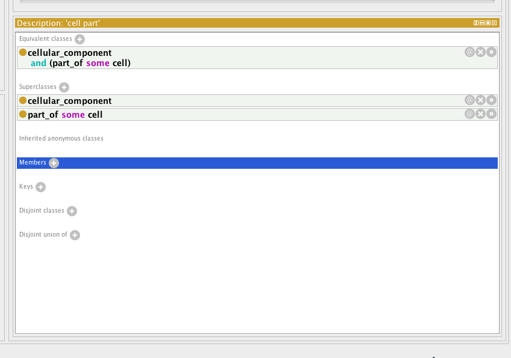
========================

Automatic classification
========================

EXERCISE: Basic classification
==============================

Go to the basic-classification folder and follow the instructions in the README.txt

Optional additional exercise if time permits:

Go to taxon-union folder

This introduces classification using “or” and “not”

Property chains
===============

Go to “occurs-in” folder and open “occurs-in-no-property-chain.owl”

Do a DL query for cell cycle processes that occur in a nucleus – note there is only one result:
===============================================================================================

========================

Note that in this ontology, there is no axiom that allows the reasoner to know that something happening in a *part of* the nucleus is happening in the nucleus. Try a different query – this time for cell cycle processes in some part of the nucleus:

This behavior is undesirable – we want ‘spindle pole body duplication in nuclear envelope’ to be returned by the first query.

Add a property chain specifying a rule:

> If p occurs\_in c
>
> And c part\_of d
>
> Then p occurs\_in d

as follows. Find ‘occurs in’ in the Object Properties tab, and click “+” next to “Property Chains”. We write the chain as

occurs\_in o part\_of -&gt; occurs\_in

Synchronize the reasoner and then run the DL query again:

Note this gives the desired results.

One useful feature of the DL query tab is the ability to make a *defined class*[3] out of a query class expression. Let’s call this “nuclear cell cycle process”:

========================

You should now see this class automatically classified, with the two spindle pole processes underneath it.

NOTE: this may be broken in P4.1?

EXERCISE: regulation-classification
===================================

Go to the basic-regulation folder and follow the instructions in the README.txt

Imports
=======

OWL ontologies may import one or more other OWL ontologies. Ontology imports are managed using the ontology URI (or IRI). Protégé allows you to import ontologies from both the web and your local files system. The imports panel is found in the Active Ontology tab by default.

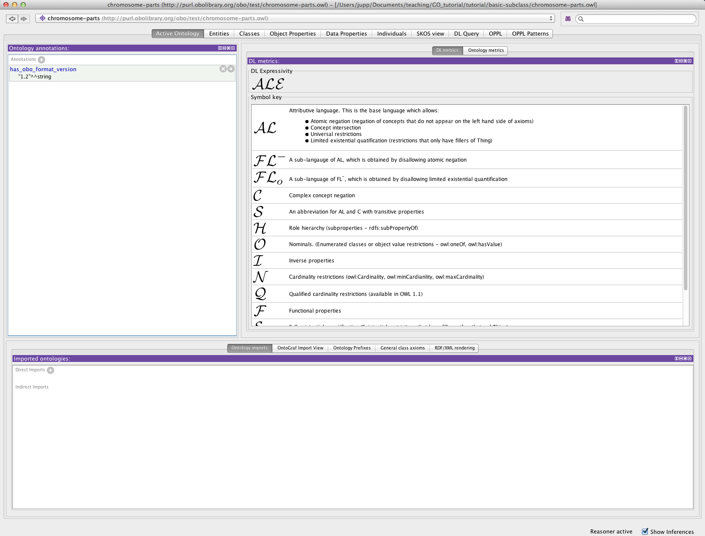

When a file is imported into an ontology, only the IRI of the imported ontology is stored. Protégé uses the IRI to try and locate the imported ontology the next time you open the file in Protégé. Most OBO ontologies have an IRI that will refer to document via a URL on the web e.g. The Gene ontology IRI is <http://purl.obolibrary.org/obo/go.owl>[4] . Navigating to this URL in a web browser will retrieve the latest gene ontology. If your ontology imports an ontology that does not resolve to a web URL, or you are not connected to the internet, then Protégé will prompt you to resolve the ontology IRI to a file on your system.

Some examples of imports can be found in

<http://wiki.geneontology.org/index.php/Ontology_extensions>

EXERCISE: response to stimulus
==============================

Go to the response-to-stimulus directory and follow the README.txt

This example makes use of a small ontology (currently maintained in the GO svn repository, and also present in the tutorial directory) called STIMO – the stimulus ontology.

Ontology libraries 
-------------------

Having to wait for Protégé to download ontologies from the web can be rather time consuming, so luckily Protégé has a mechanism for you define ontology libraries that enable you to store mapping between ontology IRIs and files on your filesystem. You can create edit your ontology library in the File -&gt; Edit ontology libraries… menu item.

========================

Ontology libraries are stored in a file on your system called catalog-001.xml. When you start working with protégé you will begin to notice many of these files cropping up on your file system. Chose a catalog-001.xml file to edit and add ontology files to your library.

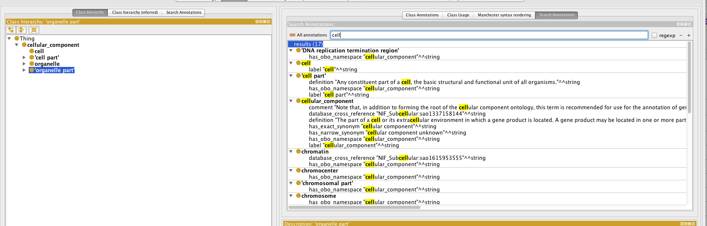

svn externals and ontology libraries
------------------------------------

Subversion has a useful feature called svn:externals, which allows a repository to link to other svn repositories.

For example, the tutorial directory has the following structure

tutorial/

external/

**ro/**

**ro.owl**

**go**

**go.owl**

**…**

basic-classification/

…

The files and directories in bold are not actually part of the repository – they are read only versions of external svn repositories that are linked. Note that these are not visible on the web interface to svn:

<http://oboformat.googlecode.com/svn/docs/tutorial/>

We are making use of this shared structure for the imports examples in this tutorial. For example, if you look at the contents of this file:

<http://oboformat.googlecode.com/svn/docs/tutorial/response-to-stimulus/catalog-v001.xml>

You’ll see this line:

&lt;uri id="User Entered Import Resolution" name="http://purl.obolibrary.org/obo/go/extensions/stimulus.owl" uri="stimulus.owl"/&gt;

This indicates that the stimulus ontology should be loaded from the same directory as the catalog xml file

Using OBO-Edit and Protégé 4 together
=====================================

With the new obo2owl converter it is possible to use OBO-Edit and Protégé together. Soon Protégé will be able to reliably translate an obo-format file to OWL (it currently takes some shortcuts and misses some things), allowing both tools to work on the same obo file.

OE2.1.1 now incorporates the obo2owl converter, so it is possible to load an obo file, save it in owl, and work on this owl file using both tools simultaneously.

Care should be taken when editing in Protégé – Protégé will not warn you if you accidentally use constructs that are not available in obo-format. It won’t warn you if you violate some of the syntactic constraints of obo-format, such as every class having at most one textual definition.

EXERCISE: obo-owl classification
================================

Open the obo-owl-classification directory and follow the README.txt

GO Ontology Extensions
======================

The following example requires you to have the GO ontology directory from the GO SVN repository checked out. This should be checked out already in the tutorial directory via svn:externals.

Navigate to ontology/extensions and open x-cellular-importer.owl. Install the OntoGraf Import View to examine the import chain:

\[at this point the instructor will guide you through some of the extension files, leading in to the rest of the tutorial\]

[1] \* Plugins are distributed as java archives (jars). To manually install a plugin you simply need to place the jar in the plugins folder inside the Protégé home/root directory.

[2] In the OWL world, sub/superclass are frequently informally referred to as child/parent, whereas in the OBO-Edit world this child/parent refers to existential restrictions too. This can create confusion e.g. with has\_part

[3] Protégé users typically use the term ‘defined class’ to mean a class with necessary and sufficient conditions – i.e. it is declared equivalent to a class expression. In the OBO-Edit world ‘defined class’ might mean a class with a text definition – it’s important to make sure you’re clear on the context when using this ambiguous term.

[4] The URL should always be the same prefix followed by the ID-space in lower case and the owl suffix – e.g. http://purl.obolibrary.org/obo/chebi.owl
